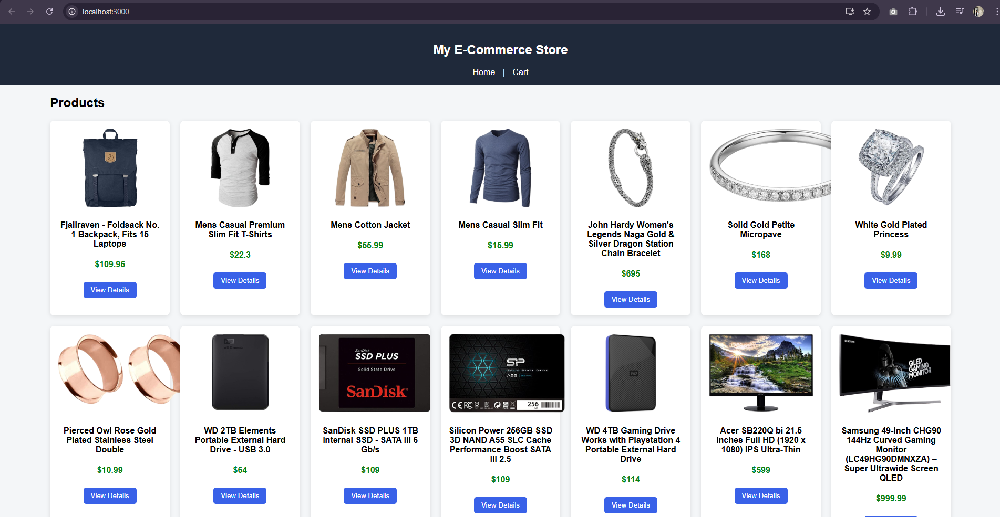
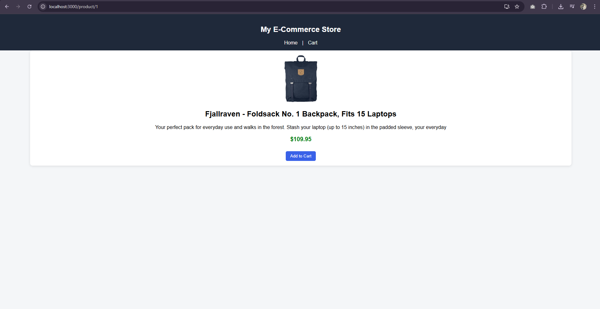
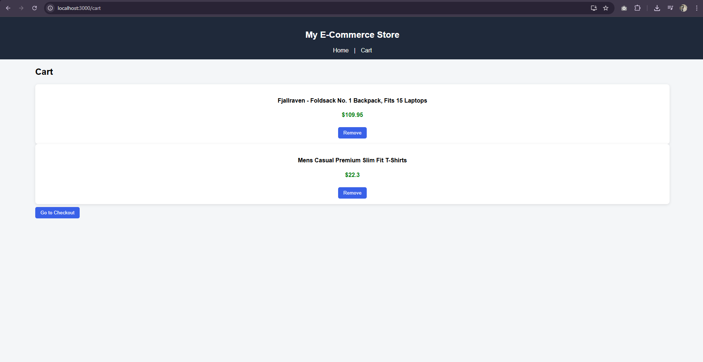
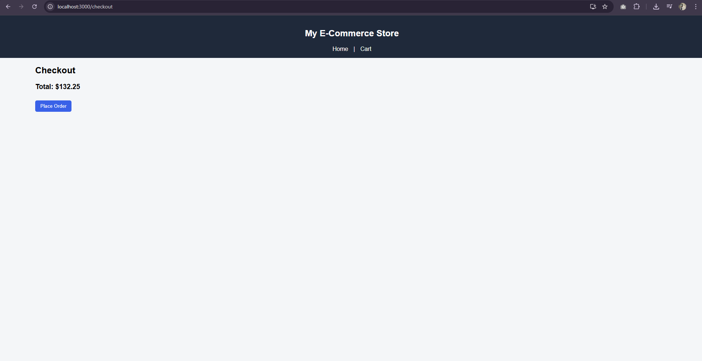

# 🛍️ React E-Commerce App

A simple and clean e-commerce frontend built using React.

---

## 🚀 Features

* Product listing from API
* Product detail page
* Add to cart functionality
* Remove from cart
* Checkout with total calculation
* Routing using React Router
* Global state using Context API

---

## 🏗️ Tech Stack

* React.js
* Axios
* React Router DOM
* Context API

---

## 📸 Screenshots

### 🏠 Home



### 🔍 Product Detail



### 🛒 Cart



### 💳 Checkout



---

## ▶️ Run Project

```bash
npm install
npm start
```

---

## 🌐 API Used

https://fakestoreapi.com

---

## 👨‍💻 Author

Kenish Hirpara
